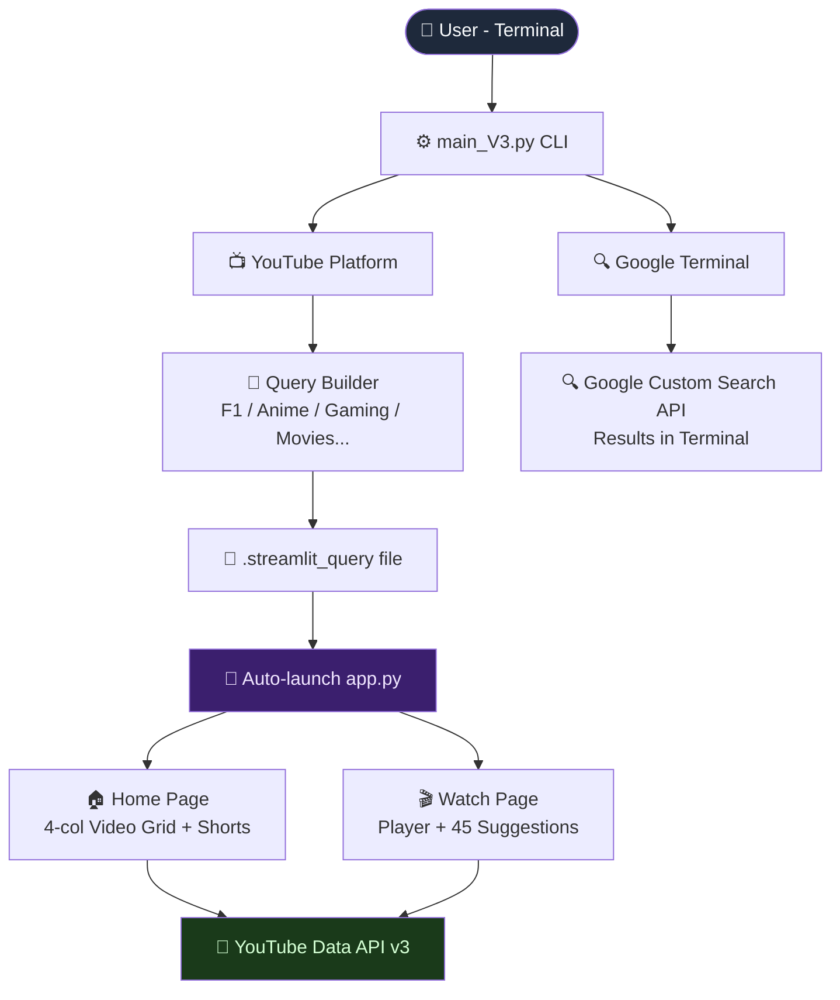

<div align="center">


<br/>

[](https://python.org)
[](https://streamlit.io)
[](https://developers.google.com/youtube)
[](https://programmablesearchengine.google.com)
[](https://selenium.dev)
[](LICENSE)
[](.)

<br/>

<div align="center">
<pre>
█░░ █▀█ █ █▀ █▀▀ █▄▀ █▄▀
█▄▄ █▄█ █ ▄█ ██▄ █░█ █░█
</pre>
</div>

> *One terminal. Multiple platforms. Infinite content.*
> A production-ready AI-powered web search agent with a built-in YouTube clone platform, Google search terminal, and smart content navigation — all from the command line.

<br/>

</div>

---

## 📋 Table of Contents

- [Overview](#-overview)
- [Key Capabilities](#-key-capabilities)
- [System Architecture](#-system-architecture)
- [How It Works](#-how-it-works)
- [Platform Breakdown](#-platform-breakdown)
- [Tech Stack](#-tech-stack)
- [Environment Setup](#-environment-setup)
- [Quick Start](#-quick-start)
- [Project Structure](#-project-structure)
- [Content Categories](#-content-categories)
- [Design Decisions](#-design-decisions--trade-offs)
- [Roadmap](#-roadmap)
- [Author](#-author)

---

## 📖 Overview

Most search tools give you a link. **LOISEKK gives you the experience.**

LOISEKK is a terminal-based AI web search agent that lets you navigate YouTube, Google, and more through a smart CLI menu — and watch videos directly inside a custom-built Streamlit web platform that mirrors the look and feel of YouTube, rebranded as your own.

> Built to demonstrate real-world agentic design: browser automation, REST API integration, custom video platform UI, intelligent query building, and seamless terminal-to-browser handoff.

---

## ⚡ Key Capabilities

| Capability | Details |
|---|---|
| 📺 **LOISEKK Video Platform** | Custom YouTube-style Streamlit UI with dark theme, sidebar, shorts, watch page |
| 🔍 **Google Terminal Search** | Search Google Custom Search API and get results directly in terminal |
| 🎯 **Smart Query Builder** | Multi-step CLI menus build precise search queries automatically |
| 🏎️ **F1 Deep Navigation** | Year → Grand Prix → Stage selection for any race since 2000 |
| ⛩️ **Anime / Gaming / Movies** | Dedicated flows for every content category |
| 🎬 **Inline Video Player** | Videos play inside the LOISEKK platform — no redirect to browser |
| ⚡ **Shorts Fullscreen Overlay** | YouTube Shorts-style fullscreen player with swipe navigation |
| 🔎 **Search Autocomplete** | Persistent search history saved across sessions |
| 🖱️ **Hover Video Preview** | Hover over any thumbnail to preview the video muted |
| 📡 **Terminal → Browser Sync** | Query picked in terminal auto-loads in the LOISEKK web platform |
| 🔁 **45 Related Suggestions** | Watch page fetches from 3 queries for rich related video panel |

---

## 🏗️ System Architecture

### Agent Flow

```
┌──────────────────────────────────────────────────────────┐
│                    Terminal (main_V3.py)                  │
│              Smart CLI · InquirerPy Menus                │
└─────────────────────────┬────────────────────────────────┘
                          │  Platform Selection
          ┌───────────────┼───────────────┐
          │               │               │
    ┌─────▼──────┐  ┌─────▼──────┐  ┌────▼───────┐
    │  YOUTUBE   │  │  GOOGLE    │  │  (Future)  │
    │  Platform  │  │  Terminal  │  │  Reddit    │
    └─────┬──────┘  └─────┬──────┘  └────────────┘
          │               │
    ┌─────▼──────┐  ┌─────▼──────────────────────┐
    │ Query File │  │ Google Custom Search API   │
    │ .streamlit │  │ Results in Terminal        │
    │ _query     │  └────────────────────────────┘
    └─────┬──────┘
          │  Auto-launch
    ┌─────▼──────────────────────────────────────┐
    │           app.py  (Streamlit)              │
    │        LOISEKK Video Platform              │
    ├────────────┬───────────────────────────────┤
    │  Sidebar   │  Home Grid  │  Watch Page     │
    │  My Query  │  4-col vids │  Player+Sugg    │
    │  Categories│  Shorts row │  45 related     │
    └────────────┴─────────────┴─────────────────┘
          │
    ┌─────▼──────────────────────────────────────┐
    │         YouTube Data API v3                │
    │   search_videos · search_shorts · cache    │
    └────────────────────────────────────────────┘
```

### Mermaid Diagram



---

## 🧠 How It Works

### Step-by-Step Pipeline

```
1. User runs main_V3.py in terminal
       │
2. Selects platform — YouTube or Google
       │
   ┌───┴──────────────────────────┐
   │ YOUTUBE                      │ GOOGLE
   │                              │
3. Smart category menu:        3. Enter search query
   F1 → Year → GP → Stage        │
   Anime → Title → Section        │
   Gaming → Game → Type       4. Google CSE API fetches
   Movies → Title → Type          top results
   Study → Topic → Level          │
       │                      5. Results printed
4. Auto-builds precise query      in terminal
       │
5. Writes query to
   .streamlit_query
       │
6. Launches app.py (Streamlit)
   in background — no manual
   streamlit run needed
       │
7. Browser opens LOISEKK
   platform with query loaded
       │
8. Videos fetch from
   YouTube Data API v3
   and render in platform
```

---

## 🎨 Platform Breakdown

### LOISEKK Home Page
- **Topbar** — Search bar with autocomplete history, mic button, Ctrl+K shortcut
- **Sidebar** — Home, Shorts, Subscriptions, My Queries (F1/Anime/Gaming...), You section, Explore, More from LOISEKK
- **Filter Chips** — All, Gaming, < 5 min, Music, Anime, DC Comics and more
- **Video Grid** — 4-column grid with hover preview, channel avatar, title
- **Shorts Row** — 6-column shorts strip with fullscreen overlay player
- **Load More** — Paginated fetching up to 50 results

### LOISEKK Watch Page
- **Video Player** — Full-width 16:9 iframe player with autoplay
- **Video Info** — Title, channel, Subscribe button, Like/Dislike/Share/Download
- **Comments** — Comment input section
- **Suggestions Panel** — 45 related videos from 3 separate API queries (title + channel + keywords)
- **Filter Chips** — All, Channel, Keyword, Recently uploaded

---

## 🔧 Tech Stack

| Layer | Technology | Role |
|---|---|---|
| **Terminal UI** | InquirerPy + Questionary | Interactive CLI menus |
| **Video Platform** | Streamlit | Custom LOISEKK web UI |
| **Video API** | YouTube Data API v3 | Search videos and shorts |
| **Search API** | Google Custom Search API | Terminal Google results |
| **Browser Automation** | Selenium + WebDriver | YouTube automation (V1/V2) |
| **Styling** | Pure HTML + CSS (in components.html) | YouTube-accurate dark theme |
| **Voice Search** | SpeechRecognition | Mic-based query input |
| **Video Fallback** | yt-dlp | Direct MP4 stream for blocked embeds |
| **Animation** | streamlit-lottie | Loading animations |
| **Player** | streamlit-player | Native React video player |
| **Config** | python-dotenv | Secure API key loading |
| **Language** | Python 3.10+ | Core runtime |

---

## 🔑 Environment Setup

Copy `.env.example` to `.env` and fill in your keys:

```bash
cp .env.example .env
```

```env
YOUTUBE_API_KEY=your_youtube_data_api_v3_key
GOOGLE_API_KEY=your_google_custom_search_api_key
GOOGLE_CX_ID=your_custom_search_engine_id
```

### Getting Your Keys

| Key | Where to get it |
|---|---|
| `YOUTUBE_API_KEY` | [Google Cloud Console](https://console.cloud.google.com) → Enable YouTube Data API v3 |
| `GOOGLE_API_KEY` | Same Google Cloud project → Credentials → Create API Key |
| `GOOGLE_CX_ID` | [Programmable Search Engine](https://programmablesearchengine.google.com) → Create Engine → Copy ID |

> ⚠️ Never commit `.env` to version control. Already listed in `.gitignore`.

---

## 🚀 Quick Start

```bash
# 1. Clone the repository
git clone https://github.com/loisekk/web-search-agent.git
cd web-search-agent

# 2. Create virtual environment
python -m venv .venv

# 3. Activate it
# Windows:
.venv\Scripts\activate
# Mac/Linux:
source .venv/bin/activate

# 4. Install dependencies
pip install -r requirements.txt

# 5. Add your API keys
cp .env.example .env
# Edit .env with your keys

# 6. Run the agent
python main_V3.py
```

### Then in the terminal:

```
════════════════════════════════════════════
        🤖  LOISEKK  Web Search Agent
             Built by Yash Brahmankar
════════════════════════════════════════════

?  🌐 Select Platform:
   ❯ 📺  YouTube  — Watch inside LOISEKK
     🔍  Google   — Search results in terminal

?  🎯 Select Category:
   ❯ 🏎️  F1
     ⛩️  ANIME
     🎬  MOVIES
     📺  WEB-SERIES
     🎮  GAMING
```

---

## 📂 Project Structure

```
WEB SEARCH AGENT/
│
├── main_V3.py              # Terminal agent — platform + category menus
├── app.py                  # LOISEKK Streamlit video platform
├── youtube_api.py          # YouTube Data API v3 search functions
├── voice_search.py         # Microphone-based voice query input
├── requirements.txt        # All Python dependencies
├── .env                    # Your API keys (never commit this)
├── .env.example            # Template for environment variables
├── .streamlit_query        # Terminal → Streamlit query handoff file
└── assets/
    └── yt_logo.png         # LOISEKK platform logo
```

---

## 🎯 Content Categories

| Category | Sub-options |
|---|---|
| 🏎️ **F1** | Year (2000–2025) → Grand Prix → Race / Qualifying / Sprint |
| ⛩️ **Anime** | 30+ titles → Intro / Full Episode / Best Clips / Trailer / OST |
| 🎬 **Movies** | Popular titles → Trailer / Review / Behind the Scenes / Clip |
| 📺 **Web Series** | Invincible, The Boys, Breaking Bad... → Season / Best Moments |
| 🎮 **Gaming** | GTA 6, Elden Ring, Minecraft... → Gameplay / Walkthrough / Speedrun |
| ✨ **Animations** | MAPPA, Ufotable, Pixar... → Best Scenes / AMV / Trailer |
| 🎭 **Cartoons** | Tom & Jerry, Rick & Morty... → Full Episode / Best Moments |
| 📚 **Study** | Python, FastAPI, ML, Docker... → Tutorial / Crash Course / Project |
| 🎵 **Music** | Lofi, Phonk, EDM, Bollywood... → Playlist / Mix / Live |

---

## 🛡️ Design Decisions & Trade-offs

| Decision | Chosen Approach | Alternative | Rationale |
|---|---|---|---|
| **Watch Platform** | Custom Streamlit HTML | Redirect to YouTube | Keep user inside LOISEKK — no context switch |
| **Query Handoff** | `.streamlit_query` file | Socket / Redis | Simple, zero-dependency, works across processes |
| **Suggestions** | 3 API calls (title+channel+keyword) | Single call | 3x more unique results, ~45 suggestions vs 15 |
| **Video Rendering** | `components.html` full page | `st.columns` layout | Full CSS control — no Streamlit padding/gap fighting |
| **API Caching** | `@st.cache_data(ttl=300)` | No cache | Prevents re-fetching same query on every interaction |
| **Shorts Player** | Fullscreen JS overlay | Inline iframe | Matches real YouTube Shorts UX exactly |
| **Key Storage** | `.env` file | Hardcoded | Security — never expose keys in source code |

---

## 🗺️ Roadmap

| Enhancement | Priority |
|---|---|
| 🌐 Reddit integration — search and display Reddit posts | High |
| 📰 News platform tab — Google News results in platform | High |
| 🤖 AI chat — ask questions about the video you're watching | High |
| 📊 Power BI dashboard — unified analytics across all platforms | Medium |
| 🔐 User auth — login, watch history, liked videos | Medium |
| 🗄️ Supabase backend — persistent user data and playlists | Medium |
| ⚛️ React migration — full frontend beyond Streamlit limits | Medium |
| 🐳 Docker support — one-command deployment | Low |
| 📱 Mobile responsive — works on phone browser | Low |

---

## 👨‍💻 Author

<div align="center">

**Yash Brahmankar**

*AI & Python Developer · Agentic Systems · Full Stack*

<br/>

[](https://github.com/loisekk)
[](mailto:yashbrahmankar95@gmail.com)
[](https://linkedin.com/in/)

<br/>

⭐ **If LOISEKK was useful, a star means everything — thank you.**

</div>

---

<div align="center">


*Built with 🔮 and Python by Yash Brahmankar · LOISEKK © 2026*

</div>
